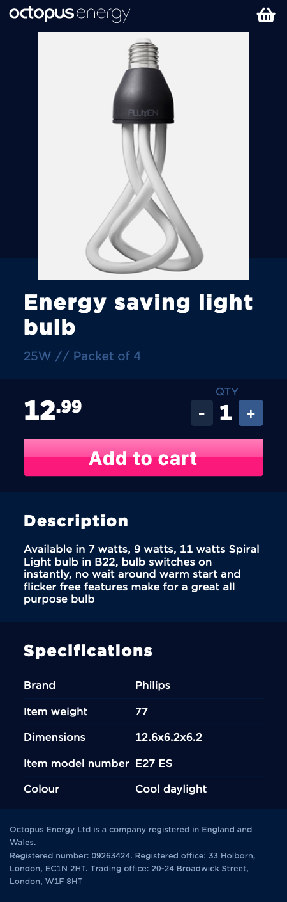
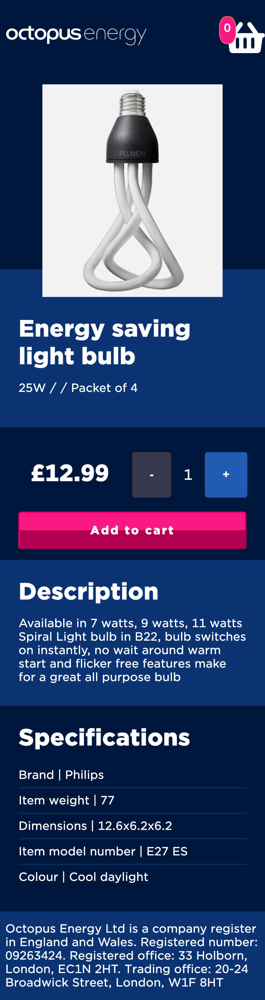

# Product-page-test

## Tech Stack
+ HTML5
+ SCSS & Bulma
+ JavaScript (ES6)
+ React
  + React-apollo
+ GraphQL
+ Apollo-boost
+ Git & GitHub

## Getting Started
If you would like to start this project in the Terminal, CD into the `client` directory. Once there, `yarn` to install dependencies. Then `yarn start` to get the project running. You can then navigate to `http://localhost:3000` to view the project.

## Release History
+ 1.0

## Screenshots

#### Requested design

#### My version

## Challenges and Improvements

### Challenges
The main challenges I had on this project were...
1. Getting 
2. Getting the test to register that it was able to add items to the basket. You're able to add the bulb to the basket and it is stored in state but the test doesn't seem to pass.
3. Getting the correct colours. I got the official colour scheme from the Octopus Styleguide online but they didn't match correctly with the AppDesign image.

### Improvements
The improvements I would like to make on this page would be the following...
1. Getting the number on the basket to hide if the basket is empty.
2. Improving the responsiveness of the image and a few elements on the page. I designed it mobile-first but found it challenging to get it to look as nice for the desktop.
3. Making the page more compliant with the WCAG.
4. Getting a better understanding of Jest and getting the tests to pass.

## Wins
I really enjoyed this challenge. I had no prior experience with GraphQL so it was a great opportunity to learn how to use it. I was able to use GraphQL to request the data from the backend and get it to display on the page. I was happy (but not completely satisfied) with how the styling went, I was able to get it to look very similar to the AppDesignMobile image. I was really happy that I learnt how to use GraphQL as I have wanted to try it for some time, and now after using it I want to use on future projects too.

#### Author
Latch Jack - You can contact me via [Twitter](https://twitter.com/LatchCodes "My twitter profile") or via [email](mailto:latch.jack@gmail.com "my email").

Thank you for reading my repository! :)